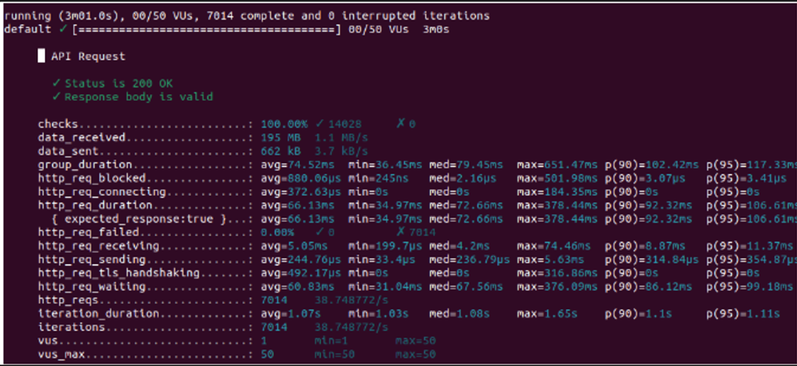

- Penjelasan :
Gambar merupakan hasil dari pengujian performa API menggunakan alat seperti k6. 
1. **Overall Test Status**:
   - Menunjukkan bahwa pengujian sedang berjalan dengan 50 Virtual Users (VUs) selama 3 menit.
   - Jumlah iterasi yang diselesaikan adalah 7014 tanpa ada iterasi yang terputus.

2. **API Request Checks**:
   - **Status is 200 OK**: Semua permintaan API berhasil dengan status kode 200.
   - **Response body is valid**: Menunjukkan bahwa respons yang diterima valid.

3. **Data Metrics**:
   - **data_received**: Total data yang diterima selama pengujian, yaitu 195 MB dengan kecepatan 1.1 MB/s.
   - **data_sent**: Total data yang dikirim selama pengujian, yaitu 662 KB dengan kecepatan 3.7 KB/s.

4. **Duration Metrics**:
   - **group_duration**: Rata-rata durasi setiap grup pengujian, dengan detail statistik seperti rata-rata (avg), minimum (min), maksimum (max), median (med), dan persentil (p90, p95).
   - **http_req_blocked**: Waktu yang dihabiskan untuk blokir permintaan HTTP.
   - **http_req_connecting**: Waktu yang dihabiskan untuk menghubungkan permintaan HTTP.
   - **http_req_duration**: Total durasi permintaan HTTP dari awal hingga akhir, termasuk waktu untuk menghubungkan, mengirim, dan menerima data.
     - **expected_response:true**: Durasi rata-rata untuk respons yang diharapkan (status 200).
   - **http_req_failed**: Persentase permintaan yang gagal.
   - **http_req_receiving**: Waktu yang dihabiskan untuk menerima respons dari server.
   - **http_req_sending**: Waktu yang dihabiskan untuk mengirim permintaan ke server.
   - **http_req_tls_handshaking**: Waktu yang dihabiskan untuk melakukan TLS handshake.
   - **http_req_waiting**: Waktu yang dihabiskan untuk menunggu respons dari server (Time to First Byte).

5. **Request Count**:
   - **http_reqs**: Total jumlah permintaan HTTP yang dibuat selama pengujian.
   - **iteration_duration**: Durasi rata-rata untuk setiap iterasi pengujian.
   - **iterations**: Jumlah total iterasi yang diselesaikan.

6. **Virtual Users Metrics**:
   - **vus**: Jumlah Virtual Users saat ini.
   - **vus_max**: Jumlah maksimum Virtual Users selama pengujian.

Metrik ini memberikan wawasan tentang kinerja API yang diuji, termasuk waktu respon, jumlah data yang ditransfer, dan kinerja di bawah beban tertentu. Jika metrik seperti `http_req_failed` rendah dan waktu respon dalam batas yang dapat diterima, ini menunjukkan bahwa API berfungsi dengan baik di bawah beban pengujian tersebut.